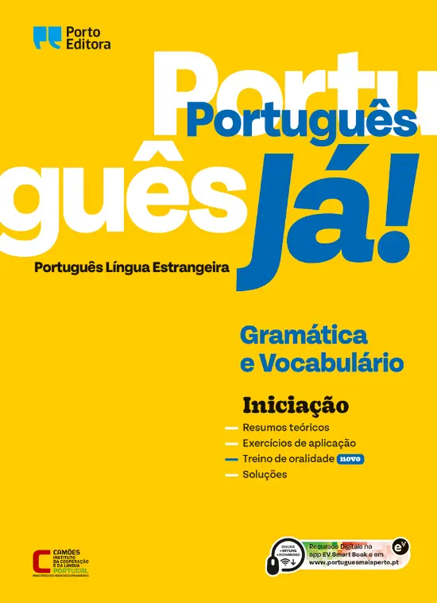
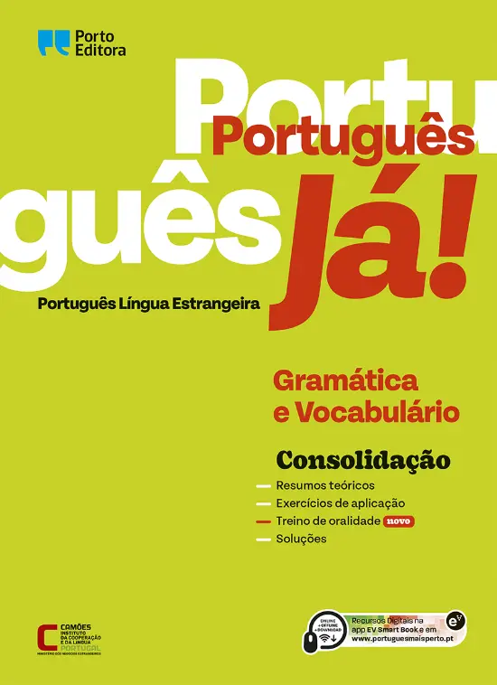
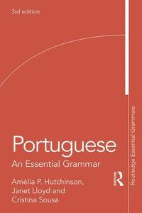
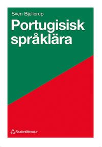
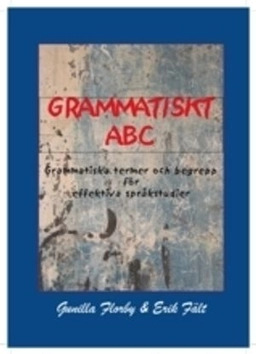
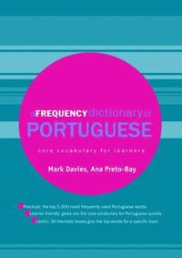
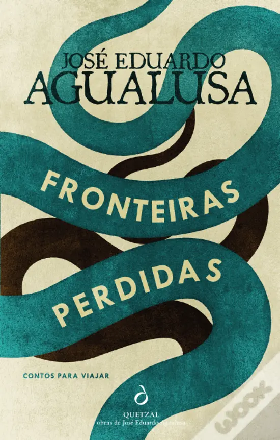

# Portuguese I / PO130A

## Schedule

[Schedule Autumn 2025](https://cloud.timeedit.net/su/web/stud1/s.html?sid=3&type=courseevent&h=t&object=cevt_07167_HT2025&startdate=20250802&enddate=20260417&l=en&h2=2)

## Literature

[Course literature List](https://albatross.it.su.se/api/education/literaturelist/pdf/PO130A/HT2025/45946/en)

### Books overview

----
Books for the courses:

* Text and language structure I, 7.5 hp
* Text and language structure II, 7.5 hp
* Oral proficiency and interaction I, 7.5 hp

---

### Português Já! _Iniciação_ Ensino Português no Estrangeiro. Gramática e Vocabulário  

(Portugisiska nu! Initiering: Undervisning i portugisiska utomlands. Grammatik och ordförråd)  
Porto Editora, 2016  
ISBN: 978-972-0-17068-2  

**Shop**

Wook.pt / 12 € / 2022 / [www.wook.pt/livro/portugues-ja-iniciacao/16896293](https://www.wook.pt/livro/portugues-ja-iniciacao/16896293)  

---

### Português Já! _Consolidação_ Ensino Português no Estrangeiro. Gramática e Vocabulário.  

(Portugisiska nu! Konsolidering: Undervisning i portugisiska utomlands. Grammatik och ordförråd)  
ISBN: 978-972-0-17069-9  

**Download**

[Anna's Archive](https://annas-archive.org/search?q=Portugu%C3%AAs+J%C3%A1%21+Consolida%C3%A7%C3%A3o+Ensino+Portugu%C3%AAs+no+Estrangeiro.+Gram%C3%A1tica+e+Vocabul%C3%A1rio.)

**Shop**

Wook.pt / 12 € / 2022 / [www.wook.pt/livro/portugues-ja-consolidacao/16786243](https://www.wook.pt/livro/portugues-ja-consolidacao/16786243)  

----
Books for the courses:

* Text and language structure I, 7.5 hp
* Text and language structure II, 7.5 hp

----

### Portuguese - An Essential Grammar  

Hutchinson, A. and J. Lloyd.  
2003

**Download**

[ia904502.us.archive.org/21/items/PortugueseEssentialGrammar/Portuguese%20essential%20grammar.pdf](https://ia904502.us.archive.org/21/items/PortugueseEssentialGrammar/Portuguese%20essential%20grammar.pdf)

**Shop**

Adlibris / 526 kr / [https://www.adlibris.com/sv/bok/portuguese-9781138234352](https://www.adlibris.com/sv/bok/portuguese-9781138234352)

Akademibokhandeln / 586 kr / [https://www.akademibokhandeln.se/bok/portuguese/9781138234352](https://www.akademibokhandeln.se/bok/portuguese/9781138234352)

---

### Portugisisk Språklära  

Bjellerup, Sven.  
1973 (1993)

**Shop**

Studentlitteratur / 303 kr / [www.studentlitteratur.se/kurslitteratur/sprakvetenskap-och-sprakdidaktik/ovriga-sprak/portugisisk-spraklara](https://www.studentlitteratur.se/kurslitteratur/sprakvetenskap-och-sprakdidaktik/ovriga-sprak/portugisisk-spraklara)

Bokus / 361 kr / [www.bokus.com/bok/9789144075235/portugisisk-spraklara/](https://www.bokus.com/bok/9789144075235/portugisisk-spraklara/)

---
### Språkstruktur 1 & 2. 

Anteckningsunderlag.  
Hedin, L.  
HT 2010  

Kompendium på Athena (???)

---

### Grammatiskt ABC

**Optional (?) but recommended**

Florby, G. & E. Fält.  
2004 eller senare  
Uppsala: Scripta textproduktion.  

**Shop**

Adlibris / 150 kr / [www.adlibris.com/sv/bok/grammatiskt-abc-grammatiska-termer-och-begrepp-for-effektiva-sprakstudier-9789189154353](https://www.adlibris.com/sv/bok/grammatiskt-abc-grammatiska-termer-och-begrepp-for-effektiva-sprakstudier-9789189154353)

---

### A Frequency Dictionary of Portuguese: Core Vocabulary for Learners 

**Optional (?) but recommended**

Mark Davies & Ana Maria Preto-Bay.  
2008  
London: Routledge.  

_Available as an e-book through the Stockholm University Library._

**Download**

[Anna's archive](https://annas-archive.org/search?q=A+Frequency+Dictionary+of+Portuguese%3A+Core+Vocabulary+for+Learners)

**Shop** 

Amazon.com / 60 $ ~ 600 kr / [https://www.amazon.com/Frequency-Dictionary-Portuguese-Routledge-Dictionaries/dp/0415419972](https://www.amazon.com/Frequency-Dictionary-Portuguese-Routledge-Dictionaries/dp/0415419972)

Akademibokhandeln / 829 kr (pocket) / [https://www.akademibokhandeln.se/bok/frequency-dictionary-of-portuguese/9780415419970](https://www.akademibokhandeln.se/bok/frequency-dictionary-of-portuguese/9780415419970)

Adlibris / 2121 kr (inbunden) / [https://www.adlibris.com/sv/bok/a-frequency-dictionary-of-portuguese-9780415419963](https://www.adlibris.com/sv/bok/a-frequency-dictionary-of-portuguese-9780415419963)

----
Books for the courses: 

* Oral proficiency and interaction I, 7.5 hp

---

### Tá falado. Brazilian Portuguese Pronunciation for Speakers of Spanish

**Optional (?) but recommended**

Prof. Orlando Kelm.
University of Texas at Austin.

**Web**

[http://coerll.utexas.edu/brazilpod/tafalado/](http://coerll.utexas.edu/brazilpod/tafalado/)

---
Books for the courses: 

* Text and language structure II, 7.5 hp
  
---

### Fronteiras Perdidas

**Optional (?) but recommended**

Agualusa, José Eduardo.  
2017  
Lisboa: Quetzal Editores.  
ISBN: 9789897223976  

**Download**

[Anna's Archive](https://annas-archive.org/search?index=&page=1&sort=&display=&q=Fronteiras+Perdidas)

**Shop**

Wook.pt / 16 € / [https://www.wook.pt/livro/fronteiras-perdidas-jose-eduardo-agualusa/19336974](https://www.wook.pt/livro/fronteiras-perdidas-jose-eduardo-agualusa/19336974)

---
