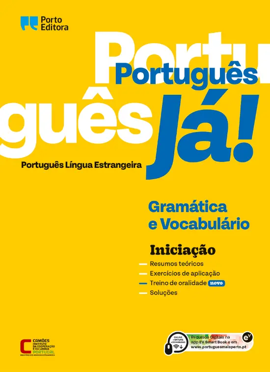
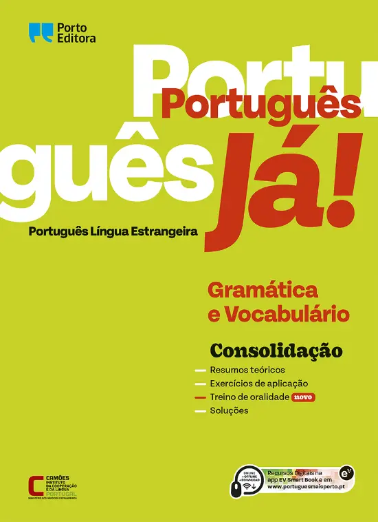
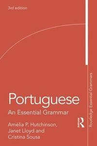
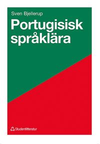
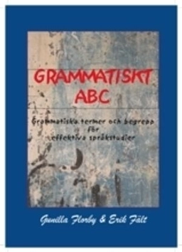
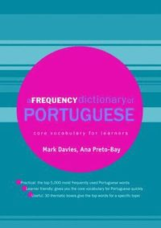
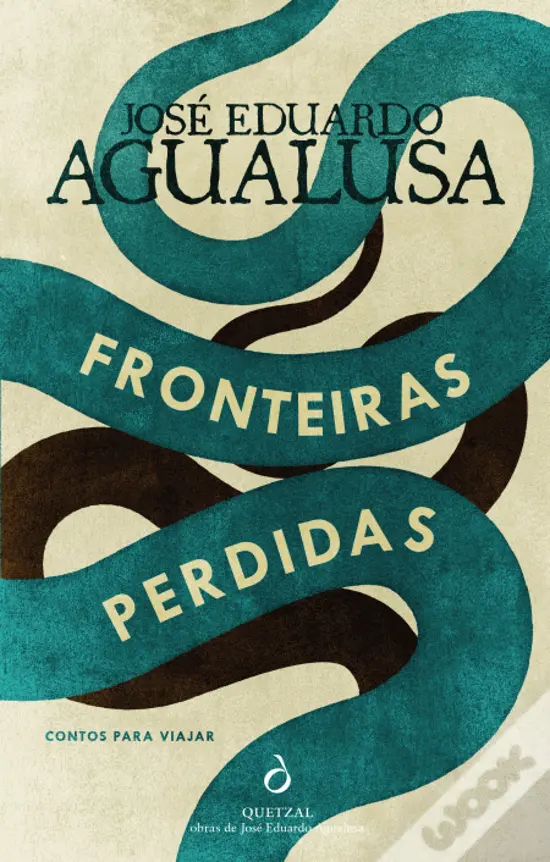

# Studier
Notes on being a student

## TODO

Campus, Datorer.
Studentkort

## Ladok

I Ladok kan du som student se information om dina studier, exempelvis vilka kurser du läser och vilka resultat du fått på dem. Det är också vanligt att du kan hämta intyg, registrera dig på kurser, anmäla dig till tentamen, ansöka om examensbevis m.m.

To view and handle your registration for courses, sign up for exams, and view your grades

[Ladok student](https://www.student.ladok.se/student/app/studentwebb/)

## Athena

Athena is the main collaboration platform for courses at Stockholm University. Please note that a few departments might be using other platforms such as iLearn. 

All important information about your course along with information from the course instructors can be found on the Athena course page.

[Athena](https://athena.itslearning.com/)

## Kurser

### Portuguese I / PO130A

[Portuguese I / PO130A](https://utbildning.su.se/english/education/course-catalogue/po/po130a?semester=HT2025&eventcode=07167)

[Schedule HT 2025 / PO130A](https://cloud.timeedit.net/su/web/stud1/s.html?sid=3&type=courseevent&h=t&object=cevt_07167_HT2025&startdate=20250802&enddate=20260417&l=en&h2=2)

[Literature List / PO130A](https://albatross.it.su.se/api/education/literaturelist/pdf/PO130A/HT2025/45946/en)

#### Böcker. 

----
* Text and language structure I  
* Text and language structure II  
* Oral proficiency and interaction I  

---

### Português Já! _Iniciação_ Ensino Português no Estrangeiro. Gramática e Vocabulário  

(Portugisiska nu! Initiering: Undervisning i portugisiska utomlands. Grammatik och ordförråd)  
Porto Editora, 2016  
ISBN: 978-972-0-17068-2  

**Shop**

Wook.pt / 12 € / 2022 / [www.wook.pt/livro/portugues-ja-iniciacao/16896293](https://www.wook.pt/livro/portugues-ja-iniciacao/16896293)  

---

### Português Já! _Consolidação_ Ensino Português no Estrangeiro. Gramática e Vocabulário.  

(Portugisiska nu! Konsolidering: Undervisning i portugisiska utomlands. Grammatik och ordförråd)  
ISBN: 978-972-0-17069-9  

**Shop**

Wook.pt / 12 € / 2022 / [www.wook.pt/livro/portugues-ja-consolidacao/16786243](https://www.wook.pt/livro/portugues-ja-consolidacao/16786243)  

----
* Text and language structure I  
* Text and language structure II  

----

### Portuguese - An Essential Grammar  

Hutchinson, A. and J. Lloyd.  
2003

**Download**

[ia904502.us.archive.org/21/items/PortugueseEssentialGrammar/Portuguese%20essential%20grammar.pdf](https://ia904502.us.archive.org/21/items/PortugueseEssentialGrammar/Portuguese%20essential%20grammar.pdf)

**Shop**

Adlibris / 526 kr / [https://www.adlibris.com/sv/bok/portuguese-9781138234352](https://www.adlibris.com/sv/bok/portuguese-9781138234352)

Akademibokhandeln / 586 kr / [https://www.akademibokhandeln.se/bok/portuguese/9781138234352](https://www.akademibokhandeln.se/bok/portuguese/9781138234352)

---

### Portugisisk Språklära  

Bjellerup, Sven.  
1973 (1993)

**Shop**

Studentlitteratur / 303 kr / [www.studentlitteratur.se/kurslitteratur/sprakvetenskap-och-sprakdidaktik/ovriga-sprak/portugisisk-spraklara](https://www.studentlitteratur.se/kurslitteratur/sprakvetenskap-och-sprakdidaktik/ovriga-sprak/portugisisk-spraklara)

Bokus / 361 kr / [www.bokus.com/bok/9789144075235/portugisisk-spraklara/](https://www.bokus.com/bok/9789144075235/portugisisk-spraklara/)

---
### Språkstruktur 1 & 2. 

Anteckningsunderlag.  
Hedin, L.  
HT 2010  

Kompendium på Athena (???)

---

### Grammatiskt ABC

**Optional (?) but recommended**

Florby, G. & E. Fält.  
2004 eller senare  
Uppsala: Scripta textproduktion.  

**Shop**

Adlibris / 150 kr / [www.adlibris.com/sv/bok/grammatiskt-abc-grammatiska-termer-och-begrepp-for-effektiva-sprakstudier-9789189154353](https://www.adlibris.com/sv/bok/grammatiskt-abc-grammatiska-termer-och-begrepp-for-effektiva-sprakstudier-9789189154353)

---

### A Frequency Dictionary of Portuguese: Core Vocabulary for Learners 

**Optional (?) but recommended**

Mark Davies & Ana Maria Preto-Bay.  
2008  
London: Routledge.  

_Available as an e-book through the Stockholm University Library._

**Download**

[Anna's archive](https://annas-archive.org/search?q=A+Frequency+Dictionary+of+Portuguese%3A+Core+Vocabulary+for+Learners)

**Shop** 

Amazon.com / 60 $ ~ 600 kr / [https://www.amazon.com/Frequency-Dictionary-Portuguese-Routledge-Dictionaries/dp/0415419972](https://www.amazon.com/Frequency-Dictionary-Portuguese-Routledge-Dictionaries/dp/0415419972)

Akademibokhandeln / 829 kr (pocket) / [https://www.akademibokhandeln.se/bok/frequency-dictionary-of-portuguese/9780415419970](https://www.akademibokhandeln.se/bok/frequency-dictionary-of-portuguese/9780415419970)

Adlibris / 2121 kr (inbunden) / [https://www.adlibris.com/sv/bok/a-frequency-dictionary-of-portuguese-9780415419963](https://www.adlibris.com/sv/bok/a-frequency-dictionary-of-portuguese-9780415419963)

----
* Oral proficiency and interaction I  

---

### Tá falado. Brazilian Portuguese Pronunciation for Speakers of Spanish

**Optional (?) but recommended**

Prof. Orlando Kelm.
University of Texas at Austin.

**Web**

[http://coerll.utexas.edu/brazilpod/tafalado/](http://coerll.utexas.edu/brazilpod/tafalado/)

---
* Text and language structure II
  
---

### Fronteiras Perdidas

**Optional (?) but recommended**

Agualusa, José Eduardo.  
2017  
Lisboa: Quetzal Editores.  
ISBN: 9789897223976  

**Download**

[Anna's Archive](https://annas-archive.org/search?index=&page=1&sort=&display=&q=Fronteiras+Perdidas)

**Shop**

Wook.pt / 16 € / [https://www.wook.pt/livro/fronteiras-perdidas-jose-eduardo-agualusa/19336974](https://www.wook.pt/livro/fronteiras-perdidas-jose-eduardo-agualusa/19336974)

---

### Portuguese as a World Language / PO1POV

[Portuguese as a World Language / PO1POV](https://utbildning.su.se/english/education/course-catalogue/po/po1pov?semester=HT2025&eventcode=07168)

[Schedule HT 2025 / PO1POV](https://cloud.timeedit.net/su/web/stud1/s.html?sid=3&type=courseevent&h=t&object=cevt_07168_HT2025&startdate=20250802&enddate=20260417&l=en&h2=2)

[Literature List / PO1POV](https://albatross.it.su.se/api/education/literaturelist/pdf/PO130A/HT2025/45946/en)
